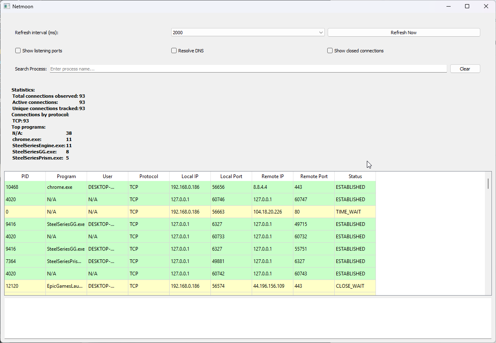

# 🚀 Netmoon

 <!-- Замените на реальный скриншот -->

Мониторинг сетевых подключений в реальном времени с удобным GUI интерфейсом.

## 📦 Установка

```bash
# Клонировать репозиторий
git clone https://github.com/palipoka/Netmoon.git
cd Netmoon

# Установить зависимости
pip install -r requirements.txt

🏃 Запуск

python Netmoon.py
Или
Netmoon.exe


🎛️ Управление
Элемент управления	Функция
🔄 Refresh interval	Интервал обновления (0.5-10 сек)
🔍 Search Process	Поиск по имени процесса
👁️ Show listening ports	Показать/скрыть listening порты
🌐 Resolve DNS	Разрешать доменные имена
✖️ Show closed connections	Показать закрытые соединения
🖥️ Интерфейс
Таблица соединений (сортировка по клику на заголовок):

PID, Программа, Пользователь

Протокол (TCP/UDP)

Локальный и удаленный адрес

Статус соединения

Детальная информация (при выборе строки):

Полный путь к исполняемому файлу

Командная строка запуска

История соединений

Статистика:

Общее количество соединений

Активные подключения

Топ процессов по числу соединений

🔍 Примеры использования

# Найти все соединения Chrome
Введите в поиск: chrome

# Показать только TCP соединения
Отсортируйте по столбцу "Protocol"

# Найти подозрительные соединения
1. Включите "Show all connections"
2. Ищите нестандартные порты (например: 4444, 31337)

📊 Фильтрация данных

# Программная фильтрация (пример)
if connection.status == 'ESTABLISHED' and connection.remote_port > 49152:
    investigate(connection)

🛠️ Технические требования

Python 3.8+

Зависимости:

psutil

PyQt5

📜 Лицензия
No lince
